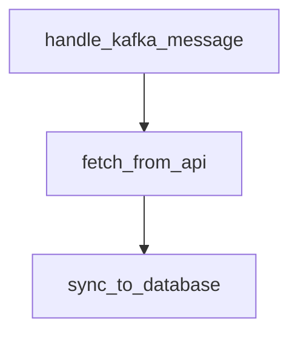

# penstock

A lightweight Python library for defining, tracing, and visualizing application flows.

## What is penstock?

Penstock lets you declaratively define how data flows through your application—from entrypoints like Kafka messages or HTTP requests, through processing steps, to side effects. It provides:

- **Correlation IDs** for grouping logs and traces across a single operation
- **Flow definitions** via decorators that double as living documentation
- **DAG visualization** to see all possible paths through your system at a glance

## Installation

```bash
pip install penstock
```

## Quick Start

```python
from penstock import flow, entrypoint, step

@flow("bom_sync")
@entrypoint
def handle_kafka_message(msg):
    """Receives BOM update from Kafka."""
    bom_id = msg.payload["bom_id"]
    return fetch_from_api(bom_id)

@flow("bom_sync")
@step(after="handle_kafka_message")
def fetch_from_api(bom_id):
    """Fetches full BOM data from external API."""
    data = api.get_bom(bom_id)
    return sync_to_database(data)

@flow("bom_sync")
@step(after="fetch_from_api")
def sync_to_database(data):
    """Syncs BOM parts to local database."""
    db.bulk_upsert(data.parts)
```

Every invocation of `handle_kafka_message` automatically gets a correlation ID that propagates through the entire flow, available in your logs via `penstock.current_flow_id()`.

## Visualize Your Flows

```python
from penstock import generate_dag

# Output as Mermaid diagram
print(generate_dag("bom_sync", format="mermaid"))

# Or render directly to PNG
generate_dag("bom_sync", format="png", output="bom_sync_flow.png")
```



## Features

### Correlation IDs

```python
import logging
from penstock import current_flow_id

logger = logging.getLogger(__name__)

@flow("bom_sync")
@step(after="fetch_from_api")
def sync_to_database(data):
    logger.info(f"[{current_flow_id()}] Syncing {len(data.parts)} parts")
    # All logs in this flow share the same ID for easy filtering
```

### Multiple Entrypoints

```python
@flow("user_update")
@entrypoint
def handle_api_request(request):
    """User updates via REST API."""
    return process_user_update(request.data)

@flow("user_update")
@entrypoint
def handle_admin_action(action):
    """Admin updates via internal tool."""
    return process_user_update(action.payload)

@flow("user_update")
@step(after=["handle_api_request", "handle_admin_action"])
def process_user_update(data):
    """Common processing for user updates."""
    ...
```

### Branching Flows

```python
@flow("order_processing")
@step(after="validate_order")
def charge_payment(order):
    ...

@flow("order_processing")
@step(after="validate_order")
def reserve_inventory(order):
    ...

@flow("order_processing")
@step(after=["charge_payment", "reserve_inventory"])
def send_confirmation(order):
    ...
```

## Integrations

### Django

```python
# settings.py
MIDDLEWARE = [
    "penstock.contrib.django.FlowMiddleware",
    ...
]
```

### Celery

```python
from penstock.contrib.celery import flow_task

@flow("async_processing")
@flow_task
def process_in_background(data):
    # Correlation ID automatically propagates to the worker
    ...
```

### Logging (structlog)

```python
import structlog
from penstock.contrib.structlog import flow_processor

structlog.configure(
    processors=[
        flow_processor,  # Adds flow_id to all log entries
        ...
    ]
)
```

## Design Goals

1. **Minimal overhead** — Decorators are cheap, context propagation uses `contextvars`
2. **Zero magic** — Your functions remain normal functions, callable without penstock
3. **Static analysis** — DAG is built at import time, not runtime
4. **Framework agnostic** — Works with Django, Flask, FastAPI, Celery, or plain Python

## License

MIT