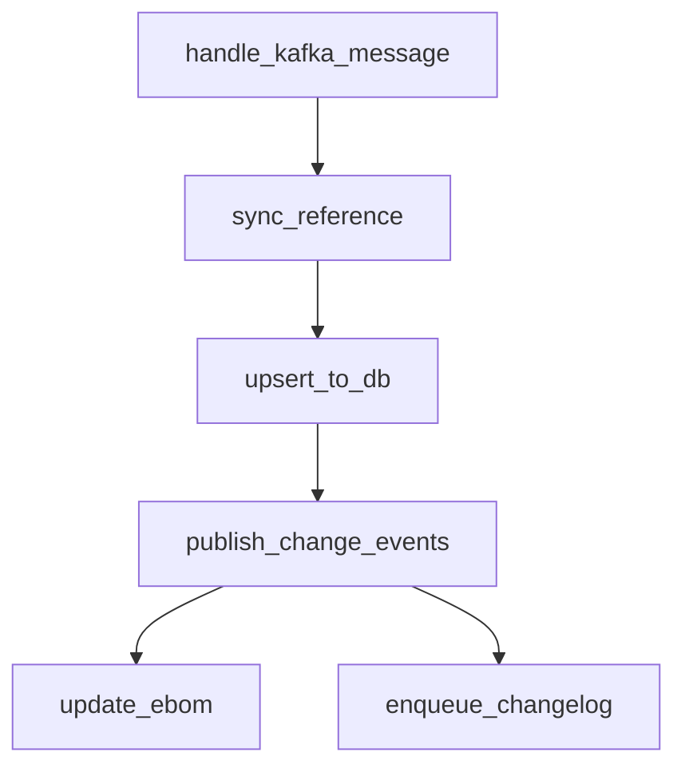

# penstock — Architecture & Backend Design

This document extends the [README](./README.md) with details on penstock's pluggable tracing backend, OpenTelemetry integration, and the design philosophy behind the layered architecture.

---

## Why penstock exists alongside OpenTelemetry

OpenTelemetry answers the question: **what happened on this specific request?** It gives you spans, waterfall traces, and latency data for individual operations at runtime.

Penstock answers a different question: **what are all the possible paths through my system?** Flow definitions via decorators produce a static DAG at import time — living architecture documentation that stays in sync with your code because it *is* your code.

These are complementary. Penstock provides the developer-facing API (clean decorators, flow definitions, DAG visualization) while OTel can serve as the backend that handles the actual tracing mechanics. Developers think in terms of flows and steps. Penstock translates that into real OTel spans when available, or falls back to structured logging when it isn't.

## Pluggable backends

Penstock separates **flow declaration** (what runs, in what order) from **trace emission** (how that execution is recorded). The `@flow` and `@step` decorators always do two things:

1. **Import time** — register the step in a flow registry used for static DAG generation. This happens regardless of backend.
2. **Runtime** — delegate to a configurable `TracingBackend` that decides how to record the execution.

```python
# penstock/backends/base.py
from abc import ABC, abstractmethod
from typing import Any
from contextlib import contextmanager


class TracingBackend(ABC):
    @abstractmethod
    @contextmanager
    def span(self, step_name: str, flow_name: str, **attrs) -> Any:
        """Wrap a step execution in a traceable span."""
        ...

    @abstractmethod
    def get_correlation_id(self) -> str:
        """Return the current correlation/trace ID."""
        ...
```

### LoggingBackend (default)

No dependencies beyond the standard library. Uses `contextvars` for correlation ID propagation and emits structured log entries with timing data.

```python
# penstock/backends/logging.py
import contextvars
import logging
import time
import uuid
from contextlib import contextmanager

logger = logging.getLogger("penstock")

_correlation_id: contextvars.ContextVar[str] = contextvars.ContextVar(
    "penstock_correlation_id", default=""
)


class LoggingBackend(TracingBackend):
    @contextmanager
    def span(self, step_name, flow_name, **attrs):
        cid = _correlation_id.get()
        if not cid:
            cid = str(uuid.uuid4())
            _correlation_id.set(cid)

        start = time.monotonic()
        try:
            yield
        finally:
            elapsed_ms = (time.monotonic() - start) * 1000
            logger.info(
                "%s completed",
                step_name,
                extra={
                    "correlation_id": cid,
                    "flow": flow_name,
                    "step": step_name,
                    "duration_ms": round(elapsed_ms, 2),
                    **attrs,
                },
            )

    def get_correlation_id(self) -> str:
        return _correlation_id.get()
```

This is sufficient for debugging with Splunk, ELK, or any log aggregator that supports structured JSON. Filter by `correlation_id` to see every step in a single flow invocation, sorted by timestamp.

### OTelBackend

Requires `opentelemetry-api` and `opentelemetry-sdk`. Creates real OTel spans with proper parent-child hierarchy. The correlation ID becomes the OTel trace ID.

```python
# penstock/backends/otel.py
from contextlib import contextmanager
from opentelemetry import trace

tracer = trace.get_tracer("penstock")


class OTelBackend(TracingBackend):
    @contextmanager
    def span(self, step_name, flow_name, **attrs):
        with tracer.start_as_current_span(
            step_name,
            attributes={"penstock.flow": flow_name, **attrs},
        ) as otel_span:
            yield otel_span

    def get_correlation_id(self) -> str:
        span = trace.get_current_span()
        ctx = span.get_span_context()
        if ctx and ctx.trace_id:
            return format(ctx.trace_id, "032x")
        return ""
```

When this backend is active, all existing `@step` decorators automatically produce spans visible in Tempo, Jaeger, or any OTel-compatible trace viewer — no code changes at call sites.

## Configuration

```python
import penstock

# Default — structured logging, no dependencies
penstock.configure(backend="logging")

# OpenTelemetry — requires opentelemetry-sdk
penstock.configure(backend="otel")

# Custom backend
penstock.configure(backend=MyCustomBackend())
```

If no explicit configuration is provided, penstock checks whether `opentelemetry` is importable. If it is, it uses the OTel backend. Otherwise, it falls back to logging. This can be overridden explicitly.

## Gradual adoption path

Penstock is designed to be useful from day one without any tracing infrastructure, and to scale up as your observability stack matures.

### Phase 1: Structured logging

Install penstock, decorate your pipeline, and get correlation IDs in your existing log aggregator immediately. No new infrastructure required.

```python
@flow("bom_sync")
@entrypoint
def handle_kafka_message(msg):
    part_number = msg.payload["part_number"]
    return sync_reference(part_number)

@flow("bom_sync")
@step(after="handle_kafka_message")
def sync_reference(part_number):
    data = fetch_from_api(part_number)
    return upsert_to_db(data)
```

Query your logs:

```
correlation_id="abc-123" | sort timestamp
```

You see an ordered list of steps with durations — enough to identify bottlenecks.

### Phase 2: DAG documentation

Use the static DAG generation to produce architecture diagrams that stay in sync with code. Add this to CI to auto-generate documentation on every merge.

```python
from penstock import generate_dag

generate_dag("bom_sync", format="mermaid")
```



### Phase 3: OpenTelemetry traces

When your team adopts a trace backend (Tempo, Jaeger, Datadog), switch the penstock backend:

```python
penstock.configure(backend="otel")
```

Every decorated function now emits real spans with parent-child hierarchy. The same decorators, the same code, but now you get waterfall visualizations and cross-service trace propagation.

### Phase 4: Cross-process propagation

For flows that span Celery tasks, Kafka consumers, or gRPC calls, penstock's contrib integrations handle context propagation automatically.

```python
from penstock.contrib.celery import flow_task

@flow("bom_sync")
@flow_task(after="publish_change_events")
def create_change_logs(changelog_dicts):
    # Trace ID propagated automatically via Celery headers
    # Appears as a child span of publish_change_events in your trace viewer
    ...
```

## Design boundaries

Penstock intentionally does **not** do the following:

- **Metrics or alerting.** Use Prometheus, Datadog, or your existing metrics stack. Penstock is about flow structure and tracing, not aggregation.
- **Sampling or tail-based collection.** That's the OTel Collector's job. Penstock emits spans; your collector decides what to keep.
- **Auto-instrumentation of libraries.** OTel already has instrumentors for Django, psycopg2, gRPC, Redis, etc. Penstock instruments *your* application logic — the business flow layer that sits above library calls.
- **Span storage or querying.** Penstock generates traces; Tempo/Jaeger/Splunk stores and queries them.

The goal is to stay in the **flow definition and developer experience** layer, and delegate everything else to purpose-built tools.
